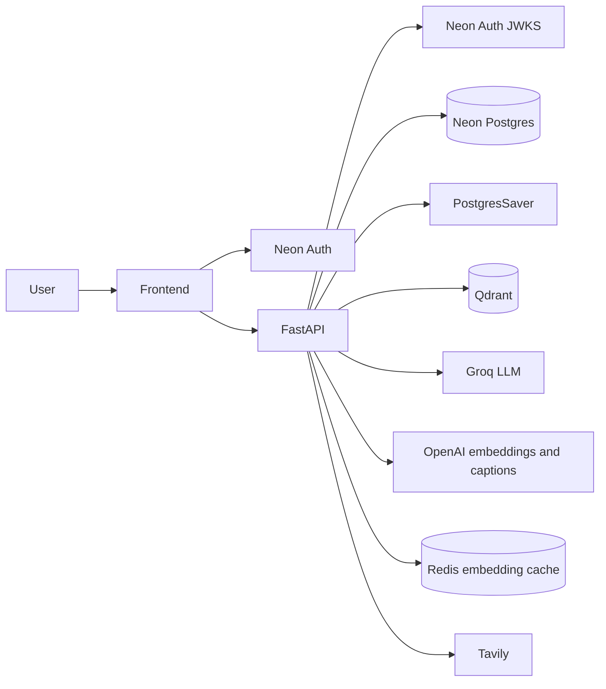

# ResearchLM

A signed-in research workspace that answers questions from **your** PDFs and URLs, streams grounded replies, and turns the thread into editable study notes.

FastAPI + LangGraph + Qdrant + Neon Postgres, with a Vite React UI and a separate DeepEval retrieval evaluation CLI.

---

## Project Overview

Reading papers is slow when answers are buried in PDFs, figures, and related web pages. Generic chatbots often invent citations or mix in knowledge that is not in the document you care about.

ResearchLM is a **per-session RAG workspace**: you upload papers or paste URLs, ask questions, and get answers produced from retrieved chunks (and optional Tavily web search when the researcher graph routes that way). Chat history is stored in LangGraph’s **Postgres checkpointer**, not a messages table. Study notes are generated from the discussion and saved in Postgres so you can edit and download them.

**Who it is for:** students and researchers who want Q&A and notes grounded in papers they actually ingested—and engineers who want a small, inspectable RAG + eval codebase.

Pipeline map: [docs/architecture.md](docs/architecture.md). Interview study guide: [interview/README.md](interview/README.md).

---

## Key Features

### Product

- Landing page for guests; Neon Auth sign-in / sign-up (`frontend/src/AuthGate.tsx`)
- Research sessions owned by JWT `sub` (`backend/api/models.py`, `backend/api/repos.py`)
- Ingest: PDF / `.txt` / `.md` upload and URL fetch (`POST /sessions/{id}/documents`, `POST /sessions/{id}/urls`)
- Streaming chat over SSE (`POST /sessions/{id}/chat`); markdown + KaTeX in the UI
- Study notes: generate from chat, autosave, preview, download `.md`
- Profile view of notes across sessions (`GET /notes`)

### RAG / AI

- Per-session Qdrant collections (`papeer_{session_id}`)
- LangGraph researcher: `router` → retrieve / claim-verify / direct answer → `generate_answer` (`backend/rag/graph.py`)
- **Production retrieval:** hybrid RRF **90% dense / 10% BM25** (`RRF_K = 60`), then `cross-encoder/ms-marco-MiniLM-L-6-v2` before top-k (`backend/rag/vector_store.py`, `backend/rag/rerank.py`)
- PDF figure extraction + `gpt-4o` captions (`backend/rag/pdf_images.py`, `backend/rag/image_captioner.py`)
- Tavily tools on the retrieve path; claim path also searches `site:arxiv.org` (no arXiv-ID ingest API)
- Structured LLM outputs via Pydantic (`backend/llm_schemas.py`)

### Evaluation (CLI, not the HTTP chat graph)

- Datasets under `evaluation/datasets/` with cached `goldens.json`
- Strategies: `keyword`, `bm25`, `dense`, `hybrid`; `rag_fusion` is a stub that falls back to dense
- DeepEval generation metrics + custom retrieval metrics (`evaluation/metrics.py`)
- Run artifacts: `evaluation/runs/*.json`, aggregates in `evaluation/reports/summary.csv`

**Also in the API, unused by the current UI:** `POST /sessions/{id}/btw` streams a side-channel web answer (`backend/rag/btw_handler.py`). `frontend/src/api.ts` does not call it.

---

## Technology Stack

| Layer | Technology | Purpose in this repo |
| --- | --- | --- |
| Frontend | React 19, Vite, TypeScript | Landing, auth gate, chat, notes |
| Frontend data | TanStack Query, `fetch` + SSE | Sessions/notes CRUD; chat stream |
| Frontend rendering | react-markdown, remark-math, rehype-katex, KaTeX, Mermaid | Chat/notes markdown |
| Auth (client) | `@neondatabase/neon-js` | Neon Auth session + access token |
| Auth (API) | PyJWT + JWKS | Verify Bearer JWT; `user_id` = `sub` |
| API | FastAPI, Uvicorn | HTTP routers, CORS, SSE |
| App DB | Neon Postgres, SQLAlchemy, Psycopg | `sessions`, `notes` |
| Agent memory | LangGraph `PostgresSaver` | Chat thread state (`thread_id` = session id) |
| Vectors | Qdrant, langchain-qdrant | Per-session embeddings index |
| Embeddings | OpenAI `text-embedding-3-small` (1536-d), `CacheBackedEmbeddings` + Redis Cloud | Index + query vector cache |
| Captions | OpenAI `gpt-4o` | Image captions at ingest |
| LLM | Groq `ChatGroq` model `openai/gpt-oss-120b` | Router, researcher, notes, session titles |
| Web search | Tavily | Retrieve-path tool + claim verification |
| Retrieval extras | rank-bm25, sentence-transformers MiniLM | Hybrid RRF + cross-encoder rerank |
| Ingest | PyMuPDF, BeautifulSoup / LangChain web loader | PDF pages and URLs |
| Orchestration | LangGraph, LangChain | Researcher + notes graphs |
| Evaluation | DeepEval, `scripts/evaluate.py` | Offline RAG experiments |

Listed in `pyproject.toml` but **not imported on live product paths:** `chromadb`, `streamlit`, `arxiv`, `langgraph-checkpoint-sqlite`. Do not treat those as the running stack.

### Embedding cache (Redis)

Chat ingest (`embed_documents`) and retrieve (`embed_query`) share LangChain `CacheBackedEmbeddings` (`blake2b` keys, namespace = embedding model, `query_embedding_cache=True`). The byte store is **Redis Cloud** (`REDIS_URL`), not `./embedding_cache/`.

Eviction is Redis **maxmemory + `allkeys-lru`**, configured in the Redis Cloud dashboard (and optionally attempted at startup via `REDIS_MAXMEMORY` / `REDIS_MAXMEMORY_POLICY`). There is no application-level key cap.

This caches **embedding vectors only** (chunks and queries). It is **not** semantic answer caching: Groq completions, session titles, and captions are not stored in Redis.

If Redis is unreachable, the API fails at startup with a clear error (no silent fallback to a file store). Evaluation still uses a separate on-disk `LocalFileStore` under `./embedding_cache/eval_<model>/`.

---

## System Architecture

Two long-lived processes: the API (`uvicorn main:app`) and the Vite dev server. Evaluation is a third, offline path.



More detail: [docs/architecture.md](docs/architecture.md) and [interview/architecture/system-architecture.md](interview/architecture/system-architecture.md).

---

## How the System Works

```text
Sign in (Neon Auth JWT)
  → FastAPI verifies JWKS, sets user_id = sub
  → Create session (Postgres)
  → Upload PDF / URLs → chunk (+ optional captions) → Qdrant collection papeer_{session}
  → Chat SSE → LangGraph researcher (thread_id = session id)
       router → retrieve (hybrid 0.9/0.1 RRF → MiniLM CE → top-k) | verify_claim | direct_answer → generate_answer
  → GET messages reads checkpoint state (no messages table)
  → Notes generate: supervisor → planner → section writers → assemble → INSERT notes
```

**Evaluation (separate):** golden QA → eval-scoped Qdrant index → strategy retriever → Groq answer prompt in `evaluation/experiment_runner.py` → DeepEval → `evaluation/runs` + `evaluation/reports/summary.csv`. This path does **not** invoke `backend/rag/graph.py`.

---

## Evaluation & Metrics

**What was evaluated:** retrieval + a simple Groq answer on cached goldens (10 questions per reported run). This path does **not** invoke `backend/rag/graph.py`.

**How:** `python scripts/evaluate.py --dataset … --strategy … --modality …`  
Default DeepEval threshold is **0.4** (`--metric-threshold`). Default judge model in the CLI is `gpt-5.4-mini`.

**Pass rate:** fraction of questions where DeepEval marks the test case `success` (all five generation metrics passing at the run’s threshold). Implemented in `evaluation/experiment_runner.py` (`_aggregate_deepeval_results`).

**Custom retrieval:** `top_k_hit` is token-overlap of expected answer vs a retrieved context at ratio **≥ 0.08** (`evaluation/metrics.py`).

### Retrieval Evaluation & Improvements

Comparable OpenClaw **text_only** runs, `text-embedding-3-small`, **n = 10**, DeepEval threshold **0.4**, reranker **Cross-Encoder** (`cross-encoder/ms-marco-MiniLM-L-6-v2`). Source: [`evaluation/reports/summary.csv`](evaluation/reports/summary.csv) and run JSON under `evaluation/runs/`.

Because n=10, pass_rate moves in **0.1** steps. Threshold 0.4 is lenient vs the older 0.7 runs. Treat the table as **directional**, not statistically conclusive.

**Do not confuse hybrid pass_rate 0.9 with a 90/10 RRF mix.** Run `20260911T113312Z` scored **90% pass** but its JSON records **`rrf_dense_weight`: 0.8 / `rrf_bm25_weight`: 0.2**.
### Retrieval Configuration Comparison

The following experiments were performed on the `openclaw` dataset using 10 evaluation questions. The current evaluation pass threshold was **0.4**. The latest experiments compare Dense retrieval against hybrid Dense + BM25 configurations with Cross-Encoder reranking.

| Run ID | Strategy | Dense : BM25 | Reranker | Threshold | Pass Rate | Contextual Precision | Contextual Recall | Answer Relevancy | Faithfulness |
|---|---|---:|---|---:|---:|---:|---:|---:|---:|
| `20260911T113312Z` | Hybrid | **80 : 20** | Cross-Encoder | 0.4 | 90% (9/10) | 98.33% | 98.00% | 98.57% | 97.78% |
| `20260911T114001Z` | Dense | **100 : 0** | Cross-Encoder | 0.4 | 90% (9/10) | **100.00%** | 89.05% | 96.26% | 94.07% |
| `20260911T115941Z` | Hybrid | **90 : 10** | Cross-Encoder | 0.4 | **100% (10/10)** | 98.33% | **100.00%** | **100.00%** | **99.00%** |

**Impact of 80:20 → 90:10 hybrid tuning:** The 90:10 configuration increased the pass rate from **90% → 100% (+10 percentage points)**, contextual recall from **98.0% → 100% (+2.0 pp)**, answer relevancy from **98.57% → 100% (+1.43 pp)**, and faithfulness from **97.78% → 99.0% (+1.22 pp)**, while maintaining contextual precision at **98.33%**.

> **Note:** Results are based on a small 10-question benchmark and a 0.4 evaluation threshold, so these results are directional rather than statistically conclusive.

**Proof (files in this repo)**

- **Dense + CE (pass 1.0):** [`evaluation/runs/20260911T115941Z_openclaw_dense.json`](evaluation/runs/20260911T115941Z_openclaw_dense.json) — `"strategy": "dense"`, `"metric_threshold": 0.4`, `"rerank_method": "cross_encoder"`, `"summary.pass_rate": 1.0`. Same row in [`evaluation/reports/summary.csv`](evaluation/reports/summary.csv).
- **Hybrid 80/20 + CE (pass 0.9):** [`evaluation/runs/20260911T113312Z_openclaw_hybrid.json`](evaluation/runs/20260911T113312Z_openclaw_hybrid.json) — `"rrf_dense_weight": 0.8`, `"rrf_bm25_weight": 0.2`, `"rerank_method": "cross_encoder"`, `"metric_threshold": 0.4`, `"summary.pass_rate": 0.9`.
- **Hybrid 90/10 + CE (production / eval default, no metrics row yet):** mix is explicit in [`evaluation/configs/openclaw_hybrid_weighted.json`](evaluation/configs/openclaw_hybrid_weighted.json) (`rrf_dense_weight` 0.9 / `rrf_bm25_weight` 0.1), `ExperimentConfig` in [`evaluation/experiment_runner.py`](evaluation/experiment_runner.py), CLI flags in [`scripts/evaluate.py`](scripts/evaluate.py), and chat `search()` in [`backend/rag/vector_store.py`](backend/rag/vector_store.py) (`RRF_DENSE_WEIGHT` / `RRF_BM25_WEIGHT` default 0.9 / 0.1). Reproduce metrics with:

```bash
python scripts/evaluate.py --dataset openclaw --strategy hybrid --modality text_only --rrf-dense-weight 0.9 --rrf-bm25-weight 0.1
```

Then cite the new `evaluation/runs/<id>_openclaw_hybrid.json` (`rrf_dense_weight` must be `0.9`).

**80/20 vs dense (same n, threshold, CE):** hybrid 80/20 is **10pp lower pass rate** (0.9 vs 1.0), **~2pp lower recall** (0.98 vs 1.0), **~3.6pp lower contextual relevancy** (0.629 vs 0.665), and **~1.2pp lower faithfulness** (0.978 vs 0.99). Answer relevancy stays high on both (~0.99–1.0). On this small set, adding BM25 at 20% did **not** beat dense+CE on pass rate.

**80/20 → 90/10 impact:** BM25 share drops 10pp (0.2 → 0.1). Pass/precision/recall for 90/10 are **not** in `summary.csv` until the command above is saved; with n=10 a one-question swing is already ±0.1.

Older May 2026 OpenClaw rows used threshold **0.7** and **lexical** rerank — do not mix them with the table above. The Attention multimodal run (`pass_rate = 0.0`) is a different dataset/top-k.

`evaluation/reports/eval_results.json` is overwritten by the latest CLI run (per-question), not a full history.

---

## Technical Highlights

- **Tenancy without stuffing identity into the agent state:** `sessions.user_id` / `notes.user_id` equal JWT `sub`. `RAGState` has `session_id` but not `user_id` (`backend/rag/graph.py`). Ownership is enforced in the API (`require_owned_session`).
- **Conversation persistence:** one `PostgresSaver`; `GET /sessions/{id}/messages` reconstructs chat from checkpoint (`backend/api/serialize.py`).
- **Session-scoped vectors:** collection name `papeer_{session_id with '-' → '_'}` so uploads do not share an index across chats.
- **Researcher routing:** structured `RouterDecision` before retrieval; retrieve path can call vector search and Tavily, with a relevancy check and at most one query rewrite.
- **Streaming UX:** SSE events `token` | `done` | `error`; empty/failed answers use a shared fallback string in API and UI.
- **Eval isolation:** strategy comparison does not require standing up the chat graph or auth.

---

## Design / Engineering Decisions

**Postgres checkpointer for chat, not SQLite**  
Why: session metadata and notes already live on Neon; `thread_id` is the session UUID.  
In repo: live code uses `PostgresSaver` (`backend/api/checkpoint.py`). `langgraph-checkpoint-sqlite` remains in `pyproject.toml` but is unused on live import paths.  
Trade-off: checkpointer tables are created by `saver.setup()`, not SQLAlchemy models.

**Hybrid 90/10 RRF + MiniLM cross-encoder in chat**  
Why: eval OpenClaw (n=10, threshold 0.4, CE) showed dense+CE at pass 1.0 and hybrid 80/20+CE at 0.9; production still uses hybrid so keyword hits remain, with BM25 downweighted to 10%. Same `reciprocal_rank_fusion` + `postprocess_retrieved` as eval.  
Trade-off: first retrieve may load MiniLM; hybrid scrolls the session for BM25. Set `RETRIEVAL_STRATEGY=dense` or `USE_CROSS_ENCODER=false` to opt out.

**Eval pipeline separate from LangGraph chat**  
Why: cheap strategy A/B on goldens without agent routing, tools, or SSE.  
Trade-off: reported metrics are **not** a measure of the production researcher graph.

**JWKS verification with `verify_aud: False`**  
Why: Neon Auth JWTs are verified for signature, algorithm, and issuer (`backend/api/auth.py`). Audience is not checked.  
Trade-off: simpler local setup; weaker audience binding than a locked `aud` check.

---

## Project Structure

```text
researchlm/
├── frontend/                 # Vite React UI
├── backend/
│   ├── api/                  # FastAPI, JWT, Postgres sessions/notes, HTTP
│   ├── rag/                  # Ingest, Qdrant, researcher graph, BTW
│   ├── notes/                # Notes LangGraph
│   └── llm_schemas.py        # Structured LLM models (not SQLAlchemy)
├── evaluation/               # CLI metrics, datasets, runs, reports
├── scripts/                  # evaluate.py, rag_smoke.py, qdrant_ping.py
├── docs/architecture.md
├── documents/                # eval-referenced PDFs (e.g. OpenClaw report)
├── main.py                   # uvicorn main:app
├── .env.example
├── frontend/.env.example
└── interview/                # Interview study guide
```

---

## Getting Started

### Prerequisites

- Python **3.12+** (`pyproject.toml` `requires-python`)
- Node.js (Vite frontend; no `engines` field in `frontend/package.json`)
- Qdrant (`QDRANT_URL`)
- Redis Cloud (`REDIS_URL`) for embedding cache
- Neon (or other) Postgres (`DATABASE_URL`)
- Neon Auth base URL
- API keys: OpenAI, Groq, Tavily (as used by embeddings, captions, ChatGroq, web search)

### Install

```bash
# clone your copy of the repo, then:
python -m venv .venv
# Windows: .venv\Scripts\activate
# Unix:    source .venv/bin/activate

pip install -r requirements.txt
# or: uv sync

copy .env.example .env          # Windows
# cp .env.example .env          # Unix
# fill DATABASE_URL, NEON_AUTH_URL, QDRANT_*, REDIS_URL, OPENAI_API_KEY, GROQ_API_KEY, TAVILY_API_KEY

cd frontend
copy .env.example .env          # set VITE_NEON_AUTH_URL and VITE_API_BASE_URL
npm install
```

Schema for `sessions` and `notes` is created at API startup (`Base.metadata.create_all` and a `user_id` column check in `backend/api/db.py`).

### Run

```bash
# repo root — API (docs at http://localhost:8000/docs, health GET /health)
uvicorn main:app --reload

# frontend
cd frontend
npm run dev
```

UI default: `http://localhost:5173`. CORS default: `http://localhost:5173`.

### Evaluate

```bash
python scripts/evaluate.py --list-datasets
python scripts/evaluate.py --dataset openclaw --strategy dense --modality text_only
python scripts/evaluate.py --dataset openclaw --strategy hybrid --modality text_only
# defaults: --rrf-dense-weight 0.9 --rrf-bm25-weight 0.1, cross-encoder on, threshold 0.4
```

Do not use `--dataset bert` unless you add `evaluation/datasets/bert/metadata.json`; the PDF alone is not listable.

### Environment (placeholders only)

Root `.env.example`: `DATABASE_URL`, optional `CHECKPOINT_DATABASE_URL`, `NEON_AUTH_URL`, `CORS_ORIGINS`, `OPENAI_API_KEY`, `GROQ_API_KEY`, `QDRANT_URL`, `QDRANT_API_KEY`, `TAVILY_API_KEY`, `RETRIEVAL_STRATEGY` (default **hybrid**), `RRF_DENSE_WEIGHT` / `RRF_BM25_WEIGHT` (**0.9 / 0.1**), `USE_CROSS_ENCODER`, `CROSS_ENCODER_MODEL`.

Frontend: `VITE_API_BASE_URL=http://localhost:8000`, `VITE_NEON_AUTH_URL=<neon-auth-base-url>`.

Never commit `.env`.

---

## Usage

1. Open the landing page and sign in (or sign up) with Neon Auth.
2. Create a session.
3. Upload a PDF (or `.txt` / `.md`) and/or add URLs.
4. Ask questions in chat; tokens stream in. History reloads from the checkpointer.
5. Generate study notes from the thread; edit and download markdown. Profile lists notes across sessions.

---

## Future Improvements

These are gaps relative to the current code, not unfinished items described as done:

- Wire or remove `POST /sessions/{id}/btw` in the UI
- Implement eval `rag_fusion` (currently a stub → dense)
- Investigate the multimodal Attention run (`pass_rate = 0.0`, low contextual relevancy)
- API rate limiting (auth exists; throttling does not)
- Drop unused Python dependencies (`chromadb`, `streamlit`, `arxiv`, sqlite checkpointer package)
- Audience (`aud`) verification on JWTs if Neon Auth issues a stable audience
- Container / hosting manifests are not in this repo

---

## Acknowledgments

LangChain / LangGraph, Qdrant, DeepEval, OpenAI embeddings, Groq, Tavily, and Neon (Postgres + Auth).
